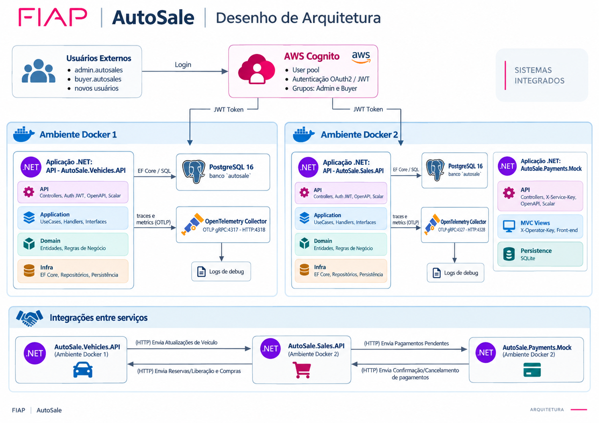
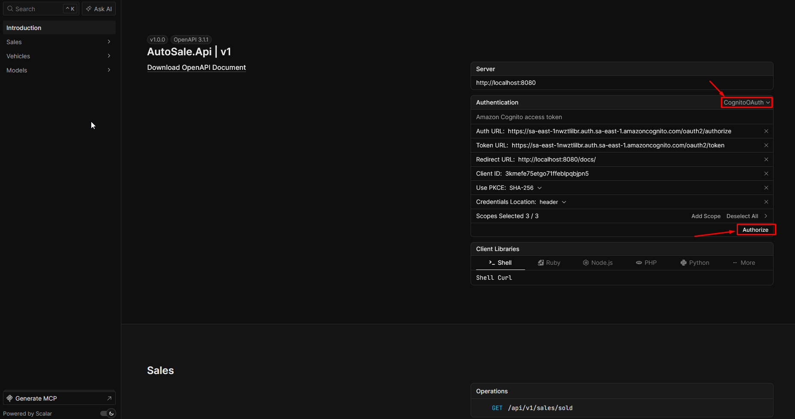
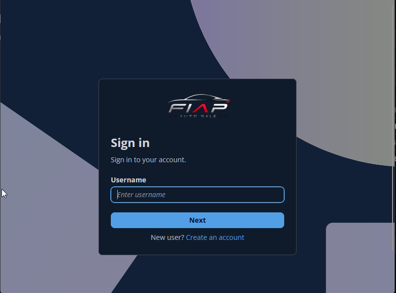

# AutoSale: Serviço de Vendas e Mock de Pagamentos

API REST do Serviço de Vendas da Prova Substitutiva do Tech Challenge FIAP — Pós-Tech SOAT, Fase 4, acompanhada de um Mock de Pagamentos para demonstração do fluxo ponta a ponta.

Este repositório contém exclusivamente o microsserviço responsável pelo catálogo de venda, processo de compra e integração com pagamentos, além do Mock de Pagamentos usado no ambiente local. O cadastro, a atualização e o ciclo de vida dos veículos pertencem ao repositório parceiro [AutoSale.Vehicle](https://github.com/ARC-373/AutoSale.Vehicle). Os serviços possuem código, execução e bancos de dados independentes e comunicam-se por APIs REST.

## Índice

- [Responsabilidades e escopo](#responsabilidades-e-escopo)
- [Funcionalidades](#funcionalidades)
- [Tecnologias e arquitetura](#tecnologias-e-arquitetura)
- [Estrutura da aplicação](#estrutura-da-aplicação)
- [Execução local](#execução-local)
- [Documentação e autenticação no Scalar](#documentação-e-autenticação-no-scalar)
- [Endpoints principais](#endpoints-principais)
- [Fluxo de compra](#fluxo-de-compra)
- [Integrações](#integrações)
- [Autenticação e autorização](#autenticação-e-autorização)
- [Modelagem do banco](#modelagem-do-banco)
- [Testes](#testes)
- [CI/CD](#cicd)
- [Observabilidade](#observabilidade)

## Responsabilidades e escopo

O Serviço de Vendas é a porta de entrada dos compradores. Ele mantém uma projeção local do catálogo recebido do Serviço de Veículos, publica as listagens de veículos disponíveis e vendidos e coordena todo o processo de compra. A venda é criada com o `sub` do comprador autenticado, o CPF informado, o preço esperado e uma chave de idempotência.

Depois da solicitação, um worker processa a venda de forma assíncrona: reserva o veículo no serviço parceiro, registra uma cobrança no Mock de Pagamentos e, após receber o resultado pelo webhook, confirma a venda ou libera a reserva. Falhas temporárias são reagendadas com retentativas e *lease*, sem exigir que os serviços compartilhem banco de dados.

O Mock de Pagamentos simula o processador externo. Ele recebe cobranças de Vendas, oferece interface web e endpoints operacionais para aprovar ou cancelar pagamentos e entrega a decisão ao webhook de Vendas com retentativas.

Cadastro, edição e autoridade sobre disponibilidade de veículos não fazem parte deste repositório. Essas responsabilidades estão documentadas em [AutoSale.Vehicle](https://github.com/ARC-373/AutoSale.Vehicle).

## Funcionalidades

| Área | Funcionalidade | Comportamento |
| --- | --- | --- |
| Catálogo | Receber veículos | Recebe do Serviço de Veículos snapshots versionados e mantém a projeção local de forma idempotente. |
| Catálogo | Listar disponíveis | Expõe catálogo público paginado, ordenado por preço crescente e identificador. |
| Compras | Solicitar compra | Comprador autenticado informa veículo, CPF e preço esperado; `Idempotency-Key` evita vendas duplicadas. |
| Compras | Processar venda | Worker reserva o veículo, cria o pagamento e retenta falhas transitórias com controle por *lease*. |
| Vendas | Consultar andamento | Usuário autenticado lista vendas ou consulta uma venda e seus estados intermediários. |
| Vendas | Listar vendidos | Expõe catálogo público de vendas concluídas, ordenado por preço crescente e identificador. |
| Veículos | Confirmar ou liberar | Pagamento aprovado confirma a reserva; pagamento cancelado libera o veículo no serviço parceiro. |
| Pagamentos | Registrar cobrança | Vendas envia ao Mock código, venda, valor e moeda; repetições equivalentes são idempotentes. |
| Pagamentos | Decisão operacional | Interface web e API permitem aprovar ou cancelar uma cobrança pendente. |
| Pagamentos | Receber resultado | Webhook autenticado e idempotente registra aprovação ou cancelamento e dispara a próxima etapa. |
| Operação | Saúde e telemetria | APIs expõem health checks; Vendas envia traces e métricas via OpenTelemetry. |

## Tecnologias e arquitetura

- .NET 10, ASP.NET Core Web API e ASP.NET Core MVC;
- Entity Framework Core 10 e Npgsql;
- PostgreSQL 16 exclusivo do Serviço de Vendas;
- SQLite exclusivo do Mock de Pagamentos;
- Amazon Cognito (OIDC/OAuth 2.0 e JWT) para compradores;
- chaves em cabeçalhos HTTP para comunicação serviço a serviço;
- OpenAPI, Scalar, Docker, Docker Compose e OpenTelemetry;
- xUnit para testes de domínio, aplicação, API, infraestrutura, persistência e Mock;
- GitHub Actions para build, testes e validação do ambiente Docker.

### Arquitetura de microsserviços

A solução da Fase 4 usa microsserviços independentes. Veículos e Vendas são implantáveis separadamente, possuem responsabilidades e bancos PostgreSQL segregados e trocam dados por HTTP/REST. Vendas não consulta o banco de Veículos: recebe atualizações do catálogo por API interna e chama a API de Veículos para reservar, confirmar ou liberar uma unidade.

O Mock de Pagamentos é um executável separado dentro deste repositório, com API, interface MVC e banco SQLite próprios. Ele representa a API externa de pagamentos no ambiente local e comunica o resultado a Vendas por webhook.

Internamente, Vendas aplica Clean Architecture. As regras de negócio permanecem independentes de HTTP, banco, Cognito e clientes externos.



| Camada ou componente | Responsabilidade |
| --- | --- |
| **Sales.Domain** | Catálogo projetado, venda, CPF, snapshot, callback, estados e invariantes. |
| **Sales.Application** | Casos de uso, DTOs e portas para persistência, identidade, relógio, Veículos e Pagamentos. |
| **Sales.Infrastructure** | EF Core/PostgreSQL, migrations, repositórios, transações, clientes HTTP e worker. |
| **SharedKernel** | Tipos independentes como `Entity`, `Result`, `Error` e `ErrorType`. |
| **Sales.Api** | REST, contratos, JWT, chaves de integração, `ProblemDetails`, Scalar e health checks. |
| **Payments.Mock** | API e UI, SQLite, criação/decisão de pagamentos e entrega de callbacks. |

## Estrutura da aplicação

```text
AutoSale.Sales/
├── .github/workflows/ci.yml
├── docs/
│   ├── architecture/
│   ├── readme/                              # Evidências do Scalar
│   └── spec/                                # Especificações do Tech Challenge
├── src/
│   ├── AutoSale.Sales.Api/
│   │   ├── Authentication/  Authorization/  Controllers/
│   │   ├── Contracts/  Extensions/  Middleware/
│   │   └── Program.cs
│   ├── AutoSale.Sales.Application/
│   │   ├── Abstractions/  Catalog/  Common/  Payments/
│   │   └── Sales/
│   ├── AutoSale.Sales.Domain/
│   │   └── Buyers/  Catalog/  Payments/  Sales/
│   ├── AutoSale.Sales.Infrastructure/
│   │   ├── BackgroundServices/  Clock/  Integrations/
│   │   └── Persistence/
│   ├── AutoSale.Payments.Mock/
│   │   ├── Authentication/  BackgroundServices/  Controllers/
│   │   ├── Contracts/  Integrations/  Payments/  Persistence/
│   │   ├── Views/  wwwroot/
│   │   └── Program.cs
│   └── BuildingBlocks/AutoSale.SharedKernel/
├── tests/
│   ├── AutoSale.Sales.Api.UnitTests/
│   ├── AutoSale.Sales.Application.UnitTests/
│   ├── AutoSale.Sales.Domain.UnitTests/
│   ├── AutoSale.Sales.Infrastructure.UnitTests/
│   └── AutoSale.Payments.Mock.Tests/
├── docker-compose.yml
├── otel-collector-config.yaml
└── AutoSale.Sales.slnx
```

## Execução local

### Usuários de teste no Cognito

| Usuário          | Senha       | Grupo    | Observações                    |
| ---------------- | ----------- | -------- | ------------------------------ |
| `admin.autosale` | `!Fiap2026` | `admins` | Usuário administrador de teste |
| `buyer.autosale` | `!Fiap2026` | --       | Usuário comprador de teste.    |
  
Outros usuários cadastrados se classificam como compradores.

### Pré-requisitos

- [Git](https://git-scm.com/);
- [Docker Desktop](https://www.docker.com/products/docker-desktop/) com Docker Compose v2;
- opcionalmente, SDK do .NET 10 para executar testes fora dos containers;
- conta confirmada no Amazon Cognito para testar a compra.

### Subir os dois microsserviços

Clone os repositórios como diretórios irmãos:

```powershell
git clone https://github.com/ARC-373/AutoSale.Vehicle.git
git clone https://github.com/ARC-373/AutoSale.Sales.git
```

Inicie primeiro o Serviço de Veículos:

```powershell
Set-Location AutoSale.Vehicle
docker compose up --build -d
```

Em outro terminal, inicie o Serviço de Vendas e o Mock de Pagamentos:

```powershell
Set-Location AutoSale.Sales
docker compose up --build -d
```

Cada repositório possui `.env`, Compose e PostgreSQL próprios. O Mock usa um volume SQLite adicional. Os ambientes compartilham somente a rede Docker `autosale-integration` e devem usar valores correspondentes para:

- `SALES_TO_VEHICLES_SERVICE_KEY`: autentica Vendas perante Veículos;
- `VEHICLES_TO_SALES_SERVICE_KEY`: autentica Veículos perante Vendas;
- `VEHICLES_BASE_URL`: endereço interno da API de Veículos;
- no repositório de Veículos, o endereço interno de Vendas e a publicação do catálogo devem estar habilitados;
- `PAYMENTS_SERVICE_KEY`, `PAYMENT_WEBHOOK_KEY` e `PAYMENTS_OPERATOR_KEY`: protegem criação da cobrança, webhook e API operacional.

  A versão disponibilizada no repositório já inclui valores válidas e pareados de variáveis de ambiente para que as duas aplicações se comuniquem corretamente.
Só realize os testes ponta a ponta depois que os dois Composes estiverem ativos e saudáveis. 
  

| Serviço | Endereço local | Finalidade |
| --- | --- | --- |
| Veículos API | <http://localhost:8080> | Cadastro, atualização, reservas e fonte de verdade. |
| Sales API | <http://localhost:8081> | Catálogo de venda, compras, vendas e webhook. |
| Payments Mock | <http://localhost:8082> | Interface operacional; documentação em `/docs`. |
| PostgreSQL de Vendas | `localhost:5433` | Persistência exclusiva de Vendas. |
| OpenTelemetry Collector | `localhost:4327` / `4328` | Recepção local de traces e métricas. |

Verifique os componentes deste repositório:

```powershell
Invoke-WebRequest http://localhost:8081/health
Invoke-WebRequest http://localhost:8081/health/live
Invoke-WebRequest http://localhost:8082/health
Invoke-WebRequest http://localhost:8082/health/live
docker compose ps
docker compose logs sales-api
docker compose logs payments-mock
```

As migrations são aplicadas na inicialização dos containers. Para encerrar preservando dados, execute `docker compose down`. Para remover também os volumes, use conscientemente `docker compose down --volumes --remove-orphans`.

## Documentação e autenticação no Scalar

Com o ambiente em execução:

- Sales API: <http://localhost:8081/docs/>;
- OpenAPI de Vendas: <http://localhost:8081/openapi/v1.json>;
- Payments Mock: <http://localhost:8082/docs/>;
- interface operacional do Mock: <http://localhost:8082/>.

Para comprar ou consultar vendas no Scalar, abra **Authentication**, selecione `CognitoOAuth`, autorize com uma conta confirmada e use o *access token*. O Authorization Code usa PKCE e solicita `openid`, `profile` e `email`.

Endpoints internos usam chaves nos cabeçalhos `X-Service-Key`, `X-Payment-Webhook-Key` ou `X-Operator-Key`.





## Endpoints principais

Erros seguem `ProblemDetails`. Nas listagens, `page` tem padrão `1` e `pageSize` tem padrão `20` e máximo `100`.

### Catálogo e vendas

| Método e rota | Permissão | Descrição |
| --- | --- | --- |
| `GET /api/v1/vehicles/available?page=1&pageSize=20` | Pública | Lista veículos disponíveis por preço e identificador. |
| `POST /api/v1/vehicles/{id}/purchase` | JWT válido | Cria ou recupera venda idempotente; retorna `202` durante o processamento. |
| `GET /api/v1/sales?page=1&pageSize=20` | JWT válido | Lista vendas e estados. |
| `GET /api/v1/sales/{saleId}` | JWT válido | Consulta uma venda. |
| `GET /api/v1/sales/sold?page=1&pageSize=20` | Pública | Lista vendas concluídas por preço e identificador. |

Exemplo:

```http
POST /api/v1/vehicles/00000000-0000-0000-0000-000000000001/purchase
Authorization: Bearer <access-token>
Idempotency-Key: compra-corolla-0001
Content-Type: application/json

{
  "buyerCpf": "12345678909",
  "expectedPrice": 149990.00
}
```

O CPF deve conter 11 dígitos e ser válido. O preço esperado protege contra alteração de valor entre consulta e reserva. `Idempotency-Key` é obrigatório, aceita até 100 caracteres e só deve ser reutilizado na mesma requisição.

### Integração com o Serviço de Veículos

| Sentido | Método e rota | Autenticação | Descrição |
| --- | --- | --- | --- |
| Veículos → Vendas | `PUT /internal/v1/catalog/vehicles/{vehicleId}` | `X-Service-Key` | Insere ou atualiza snapshot versionado no catálogo de Vendas. |
| Vendas → Veículos | `PUT /internal/v1/vehicles/{vehicleId}/reservations/{saleId}` | `X-Service-Key` | Reserva pelo preço esperado. |
| Vendas → Veículos | `PUT /internal/v1/vehicles/{vehicleId}/reservations/{saleId}/confirmation` | `X-Service-Key` | Confirma após pagamento aprovado. |
| Vendas → Veículos | `PUT /internal/v1/vehicles/{vehicleId}/reservations/{saleId}/release` | `X-Service-Key` | Libera após pagamento cancelado. |

As três últimas rotas são hospedadas por Veículos e chamadas pelo cliente HTTP deste repositório.

### Integração com o Mock de Pagamentos

| Método e rota | Permissão | Descrição |
| --- | --- | --- |
| `PUT /api/v1/payments/{paymentCode}` | `X-Service-Key` | Cria idempotentemente uma cobrança em BRL. |
| `POST /api/v1/payments/webhook` | `X-Payment-Webhook-Key` | Rota de Vendas que recebe `Paid` ou `Cancelled`. |
| `GET /api/v1/payments` | `X-Operator-Key` | Lista cobranças no Mock. |
| `GET /api/v1/payments/{paymentCode}` | `X-Operator-Key` | Consulta cobrança. |
| `POST /api/v1/payments/{paymentCode}/approve` | `X-Operator-Key` | Aprova e agenda callback. |
| `POST /api/v1/payments/{paymentCode}/reject` | `X-Operator-Key` | Cancela e agenda callback. |
| `POST /api/v1/payments/{paymentCode}/retry-callback` | `X-Operator-Key` | Reagenda callback não entregue. |
| `GET /` | Interface web | Lista pendências com ações de aprovação e cancelamento. |

Também são públicos `GET /health` e `GET /health/live` nos dois executáveis.

## Fluxo de compra

```text
Veículos ──snapshot──> catálogo de Vendas ──consulta──> comprador
                              │ solicita compra
                              v
                         Reserving
                              │ reserva em Veículos
                              v
                      AwaitingPayment ──cobrança──> Payments Mock
                              ^                         │
                              └──────── webhook ────────┘
                         pago │                  │ cancelado
                              v                  v
                    ConfirmingVehicle    CancellingVehicle
                              │                  │
                     confirma em Veículos  libera em Veículos
                              v                  v
                         Completed           Cancelled
```

1. Veículos envia um snapshot versionado para a API interna do catálogo de Vendas.
2. O comprador consulta o catálogo disponível, ordenado pelo menor preço.
3. Autenticado pelo Cognito, envia veículo, CPF, preço esperado e `Idempotency-Key`.
4. Vendas cria a venda em `Reserving` e retorna `202 Accepted`; a mesma chave e conteúdo recuperam a venda existente.
5. O worker solicita a reserva a Veículos. Conflitos definitivos deixam a venda `Rejected`; falhas transitórias são retentadas.
6. Aceita a reserva, Vendas muda para `AwaitingPayment` e envia ao Mock `paymentCode`, `saleId`, valor e `BRL`.
7. O operador aprova ou cancela. O Mock persiste a decisão e envia webhook autenticado e idempotente.
8. Em `Paid`, Vendas confirma a reserva e conclui em `Completed`. Em `Cancelled`, libera a reserva e conclui em `Cancelled`.
9. A venda concluída passa a compor o catálogo público de vendidos.

## Integrações

- **Veículos → Vendas:** o outbox parceiro publica snapshots; `sourceVersion` impede regressão por mensagens antigas.
- **Vendas → Veículos:** reserva, confirmação e liberação usam `saleId` para correlação e idempotência.
- **Vendas → Pagamentos:** a cobrança usa `paymentCode`; o Mock rejeita repetição incompatível.
- **Pagamentos → Vendas:** cada decisão possui `eventId`; repetições equivalentes são aceitas e resultados conflitantes rejeitados.
- **Resiliência:** workers usam tentativas agendadas e *leases*, sem transações ou bancos compartilhados.

## Autenticação e autorização

- catálogo disponível, catálogo vendido e health checks são públicos;
- compra, listagem e consulta de vendas exigem JWT válido do Cognito;
- a venda guarda o `sub` e o CPF transacional, mas não senha, nome ou e-mail;
- publicação do catálogo e chamadas para Veículos usam `X-Service-Key`, com chaves direcionais distintas;
- criação de pagamento usa `X-Service-Key`, webhook usa `X-Payment-Webhook-Key` e operação do Mock usa `X-Operator-Key`;
- valores do `.env` são apenas locais; ambientes publicados devem usar secrets.

## Modelagem do banco

O PostgreSQL exclusivo de Vendas possui três tabelas gerenciadas por migrations:

| Tabela | Campos relevantes | Regras e índices |
| --- | --- | --- |
| `vehicle_catalog` | veículo, dados descritivos, preço, `status`, `source_version` e timestamps | Projeção de Veículos; versão concorrente; índice `(status, price, vehicle_id)`. |
| `sales` | IDs de venda/veículo/comprador, CPF, preços, idempotência, `payment_code`, snapshot, estado, timestamps, versão, tentativas e *lease* | Pagamento e idempotência únicos; uma venda ativa por veículo; índices de vendidos e processamento. |
| `payment_callbacks` | `payment_code`, `event_id`, resultado e timestamps | Um resultado por pagamento; `event_id` único deduplica o webhook. |

O snapshot em `sales` preserva os dados recebidos no momento da reserva. O Mock mantém separadamente a tabela SQLite `payments`, cuja PK é `payment_code`; `sale_id` e `event_id` são únicos e os campos de tentativa e *lease* controlam a entrega do callback.

O banco de Veículos é independente e está documentado em [AutoSale.Vehicle](https://github.com/ARC-373/AutoSale.Vehicle).

## Testes

```powershell
dotnet test AutoSale.Sales.slnx --configuration Release
```

| Tipo | Projeto | Foco |
| --- | --- | --- |
| Domínio | `AutoSale.Sales.Domain.UnitTests` | CPF, catálogo, snapshots, callbacks, invariantes e estados da venda. |
| Aplicação | `AutoSale.Sales.Application.UnitTests` | Catálogo, compra idempotente, consultas, webhook e processamento pendente. |
| API | `AutoSale.Sales.Api.UnitTests` | Controllers, HTTP, autenticação, autorização, erros e endpoints. |
| Infraestrutura | `AutoSale.Sales.Infrastructure.UnitTests` | Clientes de Veículos/Pagamentos, cabeçalhos, URIs, serialização, respostas, timeout e indisponibilidade. |
| Persistência | `AutoSale.Sales.Infrastructure.UnitTests` | Modelo do `SalesDbContext`, tabelas, propriedades, chaves e índices. |
| Mock de Pagamentos | `AutoSale.Payments.Mock.Tests` | Entidade, serviço, API, idempotência, decisões e webhook. |

Os testes entre microsserviços devem ser executados após ambos os ambientes Docker estarem ativos: cadastre um veículo, confirme-o no catálogo de Vendas, compre, decida o pagamento no Mock e verifique a confirmação ou liberação em Veículos.

## CI/CD

O workflow [`.github/workflows/ci.yml`](.github/workflows/ci.yml) é acionado em Pull Requests, *pushes* para `master` e manualmente. A esteira restaura dependências, compila em Release, executa os testes, publica resultados TRX, constrói as imagens e valida o Docker Compose e os health checks, mantendo Vendas verificável e implantável independentemente de Veículos.

## Observabilidade

A Sales API instrumenta ASP.NET Core, clientes HTTP e runtime com OpenTelemetry e envia traces e métricas via OTLP ao Collector. IDs de veículo, venda, pagamento e evento correlacionam o fluxo distribuído.

Para diagnóstico, use `docker compose ps`, `docker compose logs sales-api` e `docker compose logs payments-mock`. `/health` verifica aplicação e banco; `/health/live` verifica o processo. O Mock registra tentativas, próxima execução e último erro de callbacks ainda não entregues.
