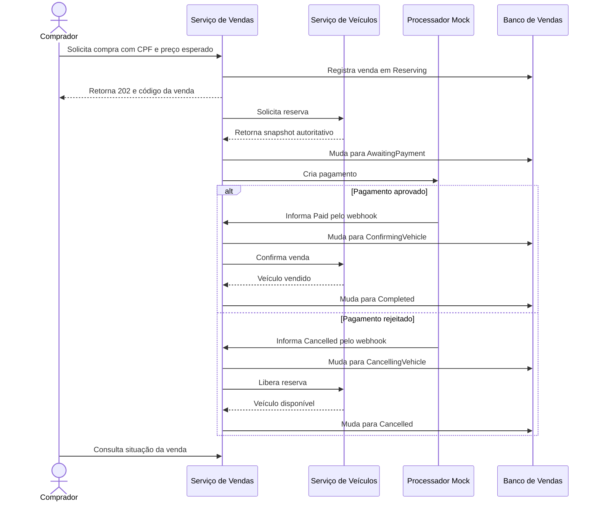
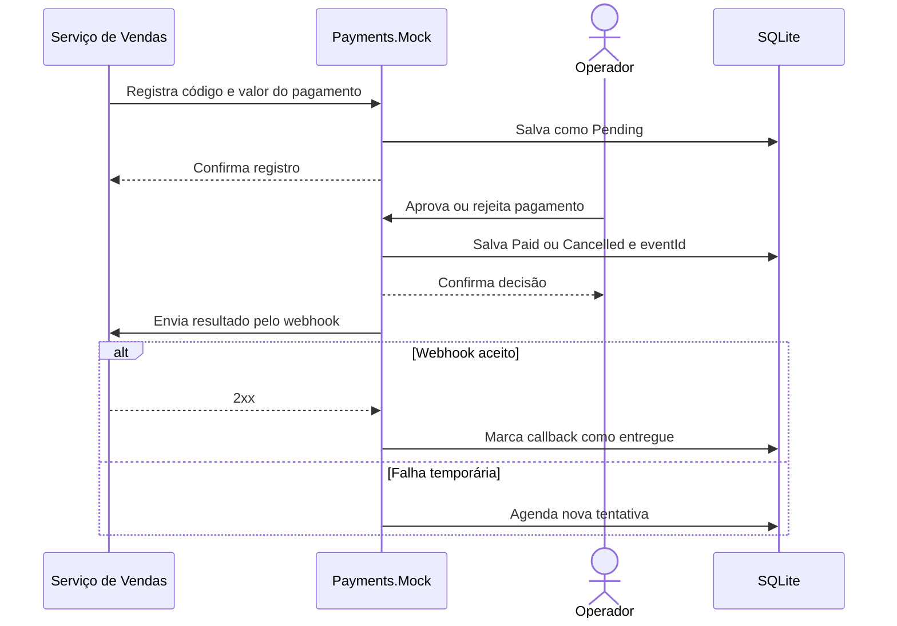

## 2. Serviço de Vendas

Responsável pelas compras, estado da venda, CPF do comprador, integração com pagamentos e catálogos públicos.

### Entidades

#### `Sale`

Agregado principal do serviço.

| Campo | Tipo/valores | Regra |
| --- | --- | --- |
| `Id` | UUID | Código da venda |
| `VehicleId` | UUID | Referência externa ao veículo |
| `BuyerSubject` | string, até 128 caracteres | `sub` obtido do JWT |
| `BuyerCpf` | 11 dígitos | CPF normalizado e validado |
| `IdempotencyKey` | string, até 100 caracteres | Única por comprador |
| `RequestHash` | string/hash | Detecta reutilização da chave com payload diferente |
| `PaymentCode` | UUID | Código único enviado ao processador |
| `VehicleSnapshot` | objeto opcional inicialmente | Dados autoritativos recebidos na reserva |
| `SalePrice` | decimal `(14,2)`, inicialmente opcional | Preço confirmado pela reserva |
| `State` | estados abaixo | Estado atual da venda |
| `CreatedAtUtc` | data/hora UTC | Início da compra |
| `PaymentRegisteredAtUtc` | data/hora opcional | Pagamento criado no Mock |
| `PaymentOccurredAtUtc` | data/hora opcional | Momento informado pelo processador |
| `CompletedAtUtc` | data/hora opcional | Data efetiva da venda |
| `CancelledAtUtc` | data/hora opcional | Conclusão do cancelamento |
| `FailureCode` | string opcional | Motivo funcional da rejeição |
| `Version` | inteiro crescente | Concorrência |
| `Attempts` | inteiro | Tentativas do processamento |
| `NextAttemptAtUtc` | data/hora opcional | Próxima execução |
| `LastError` | string opcional | Erro operacional sanitizado |
| `LeaseOwner` | string opcional | Worker responsável |
| `LeaseExpiresAtUtc` | data/hora opcional | Expiração do lease |

Estados possíveis:

| Estado | Significado |
| --- | --- |
| `Reserving` | Compra registrada; reserva ainda não confirmada |
| `AwaitingPayment` | Veículo reservado; aguardando decisão do pagamento |
| `ConfirmingVehicle` | Pagamento efetuado; confirmação em Veículos pendente |
| `CancellingVehicle` | Pagamento cancelado; liberação do veículo pendente |
| `Completed` | Venda concluída e veículo vendido |
| `Cancelled` | Pagamento cancelado e veículo liberado |
| `Rejected` | Reserva recusada por veículo inexistente, indisponível ou preço divergente |

`Completed`, `Cancelled` e `Rejected` são terminais.

#### `VehicleSnapshot`

Objeto de valor imutável incorporado à venda.

| Campo | Tipo |
| --- | --- |
| `Id` | UUID |
| `Make` | string |
| `Model` | string |
| `Year` | inteiro |
| `Color` | string |
| `Price` | decimal `(14,2)` |
| `Status` | `Available`, `Reserved`, `Sold` |
| `Version` | inteiro |
| `UpdatedAtUtc` | data/hora UTC |

#### `BuyerCpf`

Objeto de valor contendo:

- CPF normalizado com 11 dígitos;
- validação dos dois dígitos verificadores;
- rejeição de sequências repetidas;
- igualdade baseada no valor normalizado.

#### `VehicleCatalog`

Projeção local usada nas listagens. Não é a autoridade cadastral.

| Campo | Tipo/valores |
| --- | --- |
| `VehicleId` | UUID |
| `Make` | string |
| `Model` | string |
| `Year` | inteiro |
| `Color` | string |
| `Price` | decimal `(14,2)` |
| `Status` | `Available`, `Reserved`, `Sold` |
| `SourceVersion` | inteiro |
| `SourceUpdatedAtUtc` | data/hora UTC |
| `SynchronizedAtUtc` | data/hora UTC |

Uma atualização só é aplicada quando `SourceVersion` é maior. A mesma versão com conteúdo igual é idempotente; com conteúdo diferente representa conflito.

#### `PaymentCallback`

Registro do resultado recebido do processador.

| Campo | Tipo/valores |
| --- | --- |
| `PaymentCode` | UUID |
| `EventId` | UUID único |
| `Outcome` | `Paid`, `Cancelled` |
| `OccurredAtUtc` | data/hora informada pelo processador |
| `ReceivedAtUtc` | data/hora de recebimento |

Há apenas um resultado terminal por pagamento.

### História de negócio



Em paralelo, Veículos envia snapshots versionados e Vendas atualiza sua projeção local. As listagens usam somente o banco de Vendas.

### Endpoints por comportamento

**Catálogo público**

| Método | Endpoint | Comportamento |
| --- | --- | --- |
| `GET` | `/api/v1/vehicles/available` | Lista disponíveis por preço e ID crescentes |
| `GET` | `/api/v1/sales/sold` | Lista vendas concluídas por preço e ID crescentes |

**Compra e acompanhamento**

| Método | Endpoint | Comportamento |
| --- | --- | --- |
| `POST` | `/api/v1/vehicles/{id}/purchase` | Inicia compra com CPF, preço esperado e `Idempotency-Key` |
| `GET` | `/api/v1/sales/{saleId}` | Consulta estado da própria venda; admin também pode consultar |

**Pagamento**

| Método | Endpoint | Comportamento |
| --- | --- | --- |
| `POST` | `/api/v1/payments/webhook` | Recebe `Paid` ou `Cancelled` pelo código do pagamento |

**Sincronização interna**

| Método | Endpoint | Comportamento |
| --- | --- | --- |
| `PUT` | `/internal/v1/catalog/vehicles/{id}` | Aplica snapshot versionado recebido de Veículos |

**Operação**

| Método | Endpoint | Comportamento |
| --- | --- | --- |
| `GET` | `/health` | Verifica aplicação e banco |
| `GET` | `/health/live` | Verifica o processo |

---

## 3. Processador de Pagamentos Mock

Responsável apenas por registrar pagamentos de demonstração, receber uma decisão manual e devolver o resultado para Vendas.

### Entidade

#### `Payment`

| Campo | Tipo/valores | Regra |
| --- | --- | --- |
| `PaymentCode` | UUID | Chave primária, criada por Vendas |
| `SaleId` | UUID único | Venda correspondente |
| `Amount` | decimal `(14,2)` | Valor positivo |
| `Currency` | `BRL` | Moeda fixa |
| `Status` | `Pending`, `Paid`, `Cancelled` | Estado do pagamento |
| `EventId` | UUID opcional | Criado na decisão terminal |
| `CreatedAtUtc` | data/hora UTC | Registro do pagamento |
| `OccurredAtUtc` | data/hora opcional | Momento da aprovação/rejeição |
| `CallbackDeliveredAtUtc` | data/hora opcional | Confirmação de entrega ao webhook |
| `Attempts` | inteiro | Tentativas de callback |
| `NextAttemptAtUtc` | data/hora opcional | Próxima tentativa |
| `LastError` | string opcional | Último erro sanitizado |
| `LeaseOwner` | string opcional | Worker responsável |
| `LeaseExpiresAtUtc` | data/hora opcional | Expiração do lease |

Transições:

```text
Pending -> Paid
Pending -> Cancelled
```

`Paid` e `Cancelled` são terminais. Repetir a mesma decisão é idempotente; tentar a decisão oposta retorna conflito.

### História de negócio



### Endpoints por comportamento

**Registro e consulta**

| Método | Endpoint | Comportamento |
| --- | --- | --- |
| `PUT` | `/api/v1/payments/{paymentCode}` | Cria pagamento idempotente para uma venda |
| `GET` | `/api/v1/payments/{paymentCode}` | Consulta pagamento e entrega do callback |

**Decisão manual**

| Método | Endpoint | Comportamento |
| --- | --- | --- |
| `POST` | `/api/v1/payments/{paymentCode}/approve` | Marca pagamento como `Paid` |
| `POST` | `/api/v1/payments/{paymentCode}/reject` | Marca pagamento como `Cancelled` |

**Recuperação**

| Método | Endpoint | Comportamento |
| --- | --- | --- |
| `POST` | `/api/v1/payments/{paymentCode}/retry-callback` | Reagenda o callback com o mesmo `EventId` |

**Operação**

| Método | Endpoint | Comportamento |
| --- | --- | --- |
| `GET` | `/health` | Verifica aplicação e SQLite |
| `GET` | `/health/live` | Verifica o processo |

A relação central entre os serviços fica:

```text
Veículos controla o veículo
       ↓ snapshot/reserva
Vendas controla a venda
       ↓ solicitação de pagamento
Payments.Mock controla o pagamento
       ↓ resultado por webhook
Vendas confirma ou libera o veículo
```