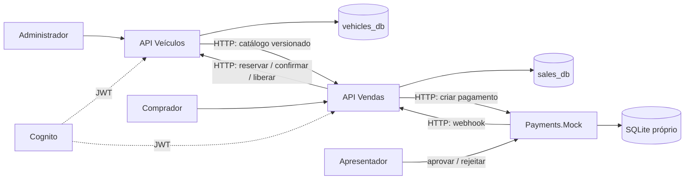

# Fase 4 — especificação de implementação e roadmap

## 1. Decisão recomendada e revisão da proposta

Evoluir o repositório atual para **Vendas** e adicionar o projeto **Payments.Mock** no mesmo repositório de Vendas, como terceiro executável, imagem e deployment independentes. Manter .NET, PostgreSQL, Clean Architecture, handlers explícitos, Result, Cognito, Scalar e OpenTelemetry presentes no projeto.

**Correção obrigatória da proposta original:** as listagens públicas de veículos disponíveis e vendidos pertencem a Vendas. O enunciado da fase 4 determina que “os endpoints de listagem e compras de veículos devem estar isolados em um serviço único” com banco isolado. Veículos mantém cadastro, edição, consulta administrativa individual e a autoridade sobre disponibilidade/reserva/venda. Vendas mantém uma projeção local do catálogo para atender as listagens sem consultar Veículos por requisição.

## 2. Requisitos de avaliação e evidências

Fonte normativa: [enunciado da fase 4](Trabalho%20Sub%20TechChallenge%20SOAT%20-%20Fase%204.md). A [fase 3](Trabalho%20Sub%20TechChallenge%20SOAT%20-%20Fase%203.md) contextualiza o reaproveitamento, mas não substitui os requisitos novos.

| Requisito da fase 4 | Implementação | Evidência de aceite |
| --- | --- | --- |
| Cadastrar marca, modelo, ano, cor e preço | POST em Veículos, validações existentes | Teste HTTP e cadastro no vídeo |
| Editar veículo | PUT em Veículos; somente Available | Edição refletida no catálogo de Vendas |
| Efetuar venda com CPF e data | Vendas persiste CPF, instante de criação e instante de conclusão | Venda concluída e consulta autenticada/dados de teste no banco |
| Webhook por código de pagamento, efetuado/cancelado | POST de resultado em Vendas, idempotente | Aprovação e cancelamento pelo Mock |
| Disponíveis por preço crescente | Consulta exclusivamente no banco de Vendas | Dois ou mais preços, empate e paginação testados |
| Vendidos por preço crescente | Apenas vendas Completed, snapshot do veículo e preço da venda | Pendentes e canceladas ausentes |
| Listagens e compras no mesmo serviço, banco isolado | Ambas em Vendas; PostgreSQL dedicado | URLs, pods, conexões e permissões demonstrados |
| Comunicação HTTP entre serviços | Clientes HTTP tipados; sem leitura cruzada de banco | Trace/log correlacionado e contratos |
| Dois repositórios funcionais | Atual → Veículos; novo → Vendas + Mock | Dois links acessíveis no PDF |
| Testes passando e cobertura mínima de 80% | Gate de cobertura nos dois repositórios | Relatório agregado por aplicação, artefato de CI e execução no vídeo |
| CI/CD, PR e deploy no merge da principal | PR valida; push à principal protegida publica e implanta | PR mergeado, execução do CD e ambiente atualizado |
| Deployments e Services | Manifests Kubernetes versionados e realmente utilizados | Recursos aplicados no ambiente de demonstração |
| README em cada repositório | Implementação, contratos, execução local, testes e publicação | Reprodução a partir de clone limpo |
| PDF de links e vídeo ponta a ponta | Checklist de entrega na seção 14 | Arquivos finais e links conferidos |

Interpretações conservadoras: o texto menciona cobertura geral para microsserviços e destaca 80% no repositório de Vendas; aplicar >=80% de linhas em **cada aplicação principal**, incluindo código executável de API, Application, Domain, Infrastructure e SharedKernel. Incluir também o Mock no gate do seu projeto para não diluir o resultado de Vendas.

## 3. Diagnóstico da implementação atual

Análise estática dos arquivos em 07/09/2026. A aprovação anterior da fase 3 é informação fornecida pelo solicitante; não foi reavaliada. Não foram executados testes nem medida cobertura nesta revisão documental.

| Evidência no projeto | Consequência para a fase 4 |
| --- | --- |
| `src/AutoSale.Application/Sales/Purchase/PurchaseVehicleHandler.cs` cria Sale e chama `Vehicle.MarkAsSold` na mesma transação | Separar iniciação, reserva, pagamento e conclusão; não copiar esse fluxo sem adaptação. |
| `src/AutoSale.Infrastructure/Persistence/Repositories/VehicleRepository.cs` usa `FOR UPDATE` | Reaproveitar em Veículos para transições locais; não manter bloqueio enquanto chama HTTP. |
| `src/AutoSale.Infrastructure/Persistence/Configurations/SaleConfiguration.cs` tem FK para Vehicle e unicidade irrestrita de vehicle_id | Remover dependência de entidade remota em Vendas e permitir nova tentativa após cancelamento. |
| `src/AutoSale.Domain/Sales/Sale.cs` registra apenas buyerSubject, preço e PurchasedAtUtc | Adicionar CPF, estados, código de pagamento, snapshot e timestamps com semântica explícita. |
| `src/AutoSale.Domain/Vehicles/Vehicle.cs` tem Available/Sold e Version | Adicionar Reserved e associação à venda responsável; bloquear edição também em Reserved. |
| `src/AutoSale.Api/Controllers/VehiclesController.cs` agrupa cadastro, edição, listagem e compra | Separar actions por aplicação; preservar rotas públicas quando possível, mudando host. |
| `src/AutoSale.Infrastructure/Persistence/Repositories/SaleRepository.cs` lista todas as vendas | Filtrar Completed e retornar características do veículo, não apenas vehicleId. |
| `src/AutoSale.Api/Contracts/Sales/SaleResponse.cs` expõe idempotencyKey na listagem | Criar contrato público específico de vendidos, sem CPF, subject, paymentCode ou chave. |
| `.github/workflows/ci.yml` roda testes, build e Compose temporário no runner | Acrescentar coleta/gate de cobertura, registry e deploy persistente após merge; o smoke atual não comprova esse destino. |
| `tests/AutoSale.Api.IntegrationTests/` contém somente csproj | Implementar testes HTTP/DB reais; a existência do projeto não equivale a testes de integração. |
| `Directory.Packages.props` já inclui coverlet.collector | Reaproveitar coletor; falta ativar coleta, agregar e bloquear cobertura insuficiente. |

## 5. Arquitetura, dados e propriedade



Veículos é autoridade sobre dados cadastrais e posse da reserva. Vendas é autoridade sobre comprador, preço contratado, pagamento e resultado da venda. O catálogo em Vendas é uma cópia de leitura eventualmente consistente; uma reserva sempre valida o registro autoritativo por HTTP. Não existe transação distribuída, join entre bancos ou acesso ao banco alheio. Essa separação segue o princípio de [propriedade de dados por microsserviço](https://learn.microsoft.com/en-us/dotnet/architecture/microservices/architect-microservice-container-applications/data-sovereignty-per-microservice).

### 5.1 Veículos — tabelas

- `vehicles`: campos atuais, `status` Available/Reserved/Sold, `reservation_sale_id` nullable, `sold_sale_id` nullable, `version` crescente. Reservar atribui saleId; confirmar mantém a referência final; liberar limpa apenas a reserva daquele saleId. Incrementar versão em toda alteração.
- `vehicle_reservations`: `sale_id` PK, `vehicle_id`, `status` Reserved/Confirmed/Released, snapshot de marca/modelo/ano/cor/preço/versão aceitos, timestamps. O histórico impede uma repetição antiga de reserva de reabrir uma reserva já liberada; não apagar durante a entrega.
- `catalog_outbox`: `id`, `vehicle_id`, `vehicle_version`, `payload_json`, `created_at_utc`, `processed_at_utc`, `attempts`, `next_attempt_at_utc`, `last_error`, campos de lease. Inserir snapshot integral junto com a alteração de Vehicle na mesma transação.
- Manter índice `(status, price, id)`; unicidade de versão por veículo na outbox. Reserva e edição devem disputar a mesma linha/token de concorrência. Mapear conflito para 409.

### 5.2 Vendas — tabelas

- `vehicle_catalog`: vehicleId PK, dados do veículo, preço, status e `source_version`. Somente integração/retorno autoritativo atualiza essa projeção, sempre se versão recebida for maior. Índice `(status, price, vehicle_id)`.
- `sales`: id, vehicleId (identificador remoto, **sem FK remota**), buyerSubject, buyerCpf normalizado, idempotencyKey, requestHash, paymentCode único, snapshot dos dados/preço reservados, state, createdAtUtc, paymentOccurredAtUtc nullable, completedAtUtc nullable, cancelledAtUtc nullable, failureCode, version, nextAttemptAtUtc, attempts, lastError e lease. Antes da reserva, snapshot/preço podem ser nulos; exigir preenchimento a partir de AwaitingPayment.
- Unicidade `(buyer_subject, idempotency_key)` obrigatória. Índice único parcial em `vehicle_id WHERE state NOT IN ('Cancelled','Rejected')`: impede duas tentativas ativas ou duas vendas concluídas, mas permite recompra após cancelamento. `Rejected` representa tentativa recusada antes de existir pagamento.
- `payment_callbacks`: paymentCode PK, eventId único, outcome, occurredAtUtc, receivedAtUtc. Neste escopo há **um único resultado terminal por pagamento**. Registrar resultado e mudança de Sale na mesma transação; reenvio equivalente é no-op e divergente é conflito.
- Índice para vendidos `(sale_price, id) WHERE state = 'Completed'`. Preço decimal com precisão atual `(14,2)`; BRL fixo. Dates UTC em ISO-8601 nos contratos.

CPF é obrigatório na nova compra: 11 dígitos, validar dígitos verificadores e rejeitar sequências repetidas. Tratar como dado informado pelo comprador, sem afirmar verificação de identidade. Cognito continua armazenando identidade e credenciais; o snapshot do CPF da transação passa a existir em Vendas para atender à fase 4. Não enviá-lo ao Mock, à projeção, aos logs nem aos endpoints públicos. Não criar cadastro local de clientes.

### 5.3 Mock — persistência mínima

`payments`: paymentCode PK, saleId único, amount, currency, status Pending/Paid/Cancelled, eventId nullable, occurredAtUtc, callbackDeliveredAtUtc nullable, attempts, nextAttemptAtUtc e lastError. SQLite em volume, uma réplica; atualização condicional evita decisões conflitantes. Sem abstrair gateway genérico ou simular cartão/banco. Reinício deve conservar decisões e callbacks pendentes.

## 6. Estados e consistência entre aplicações

```text
Vehicle: Available -> Reserved -> Sold
                         |-> Available (pagamento cancelado)

Sale: Reserving -> AwaitingPayment -> ConfirmingVehicle -> Completed
           |               |-> CancellingVehicle -> Cancelled
           |-> Rejected (404/409 definitivo na reserva)

Payment.Mock: Pending -> Paid OU Cancelled (terminal)
```

`Reserving` já é uma solicitação persistida, mas ainda não uma reserva aceita. `AwaitingPayment` significa reserva obtida; o pagamento pode estar em processo de criação no Mock. Guardar `paymentRegisteredAtUtc` nullable para distinguir e retomar esse passo. `ConfirmingVehicle` significa pagamento efetuado e confirmação de Veículos pendente; nunca liberar esse veículo por timeout. `Completed` significa que Veículos confirmou Sold e Vendas gravou conclusão. `CancellingVehicle` retém a tentativa ativa até a liberação autoritativa terminar. Sem expiração automática, estorno ou mudança do resultado terminal no escopo; pagamentos Pending podem ser rejeitados manualmente na demonstração.

### 6.1 Compra

1. API valida JWT, CPF e Idempotency-Key. Procura `(subject,key)` antes de validar disponibilidade atual. Mesma chave e payload normalizado retorna a venda existente; payload diferente retorna 409. A chave não pode criar venda para outro veículo/CPF.
2. Em transação local, cria Sale em Reserving com saleId e paymentCode UUID gerados por Vendas. Persistir antes de chamar qualquer serviço. Restrição única resolve compras concorrentes também entre réplicas. Devolver 202 com Location de consulta; worker prossegue imediatamente ou na próxima varredura.
3. Worker chama reserva em Veículos usando saleId e o preço esperado da compra. Em Veículos, transação curta bloqueia veículo, valida Available/preço, cria registro de reserva e outbox e confirma. Resposta contém snapshot e versão. Repetir mesma operação devolve reserva existente. 404/409 definitivos levam a Rejected; timeout mantém Reserving para repetição, pois reserva pode ter sido aplicada.
4. Vendas persiste snapshot/preço autoritativos, atualiza projeção por versão e passa a AwaitingPayment. O preço esperado evita comprar silenciosamente por outro valor quando o catálogo estiver atrasado.
5. Worker cria pagamento no Mock com paymentCode estável. Mesmo código/payload retorna o pagamento existente. Grava paymentRegisteredAtUtc após resposta. Crash após criação é recuperado por repetição. Callback pode chegar antes dessa gravação: já existe Sale com paymentCode e AwaitingPayment e deve aceitá-lo.

### 6.2 Pagamento efetuado

1. Operador aprova Pending no Mock. Transação local grava Paid + eventId estável + data, deixando callback pendente.
2. Worker do Mock envia webhook. Vendas autentica a origem, encontra paymentCode, bloqueia Sale, grava callback e muda AwaitingPayment para ConfirmingVehicle; retorna 202 após commit. Duplicata equivalente retorna 200. Não precisa aguardar Veículos para responder.
3. Worker de Vendas confirma reserva via HTTP. Veículos exige saleId proprietário, marca Sold e reserva Confirmed e cria outbox na mesma transação. Repetição de confirmação já aplicada retorna 200.
4. Vendas grava Completed e completedAtUtc, e aplica a versão retornada ao catálogo. A data da venda é completedAtUtc; paymentOccurredAtUtc fica separada. O vendido usa o snapshot/preço da reserva, independentemente do atraso da projeção.

### 6.3 Pagamento cancelado

Mesmo início, com resultado Cancelled e Sale em CancellingVehicle. Worker libera a reserva por HTTP. Veículos marca reserva Released e veículo Available, produzindo nova versão/outbox. Vendas só grava Cancelled depois da liberação confirmada. Nova compra usa nova chave, saleId e paymentCode. Uma liberação repetida de reserva Released é 200 e **não modifica** reserva posterior de outra venda.

### 6.4 Sincronização do catálogo

Escolha: outbox pequena em Veículos + entrega HTTP de snapshots para Vendas. Escrever banco e disparar HTTP sem persistir pendência perderia atualizações em uma queda. A [documentação da Microsoft sobre publicação e persistência](https://learn.microsoft.com/en-us/dotnet/architecture/microservices/multi-container-microservice-net-applications/subscribe-events) descreve esse problema; aqui aplica-se a persistência da pendência com transporte HTTP, sem broker.

Worker envia `PUT /internal/v1/catalog/vehicles/{vehicleId}`. Vendas faz upsert condicional por versão: maior aplica, menor ignora, igual com mesmo payload é no-op; igual divergente retorna 409 e gera diagnóstico. Retornos de reserva/confirmação/liberação usam a mesma regra. Atraso/reordenação nunca pode substituir Sold v5 por Available v3.

Listagens não fazem HTTP para Veículos. Disponíveis filtra Available e exclui veículos com Sale local não terminal/Completed, protegendo também o intervalo entre pedido e sincronização. Cancelled/Rejected não ocultam o veículo. Bootstrap de base existente: comando operacional em Veículos enfileira snapshots de todos os veículos na própria outbox; não abrir acesso de Vendas ao banco de Veículos. Sem exclusão de veículos no escopo, portanto não há tombstones.

### 6.5 Recuperação mínima obrigatória

| Falha | Comportamento definido |
| --- | --- |
| Commit do veículo seguido de queda antes de sincronizar | Outbox permanece e reenvia após reinício. |
| Reserva aplicada, resposta perdida | Reserving repete mesmo saleId; Veículos devolve snapshot já reservado. |
| Mock criou pagamento, resposta perdida | Reenvio com mesmo paymentCode não cria outro pagamento. |
| Callback repetido/resultado contrário | Equivalente 200; contrário 409, sem mudar resultado anterior. |
| Webhook recebido, queda antes de confirmar Veículos | Estado ConfirmingVehicle persistido retoma após reinício. |
| Veículos confirmou/liberou, Vendas caiu antes de gravar | Repete operação idempotente e conclui estado local. |
| Callback antigo depois de nova compra | Código e reserva antigos não alteram a nova venda/reserva. |
| Duas instâncias processam o mesmo registro | Lease com expiração, atualização condicional e operações idempotentes. |
| HTTP 429/5xx/timeout | Retry persistido com espera progressiva; respeitar Retry-After. |
| 401/403 de integração ou conflito impossível de estado | Manter pendência, registrar erro e sinalizar intervenção; nunca converter em pagamento cancelado. |

Defaults propostos: timeout HTTP 5 s; varredura a cada 2 s; backoff 2, 5, 15, 30 e 60 s, com limite de 60 s e jitter; lease 30 s renovável. Não manter transação SQL aberta durante HTTP. Workers reivindicam lote pequeno com lock/lease, fazem HTTP fora da transação e confirmam localmente. Estados de vendas e outbox sobrevivem a restart. Após dez falhas sinalizar erro operacional e continuar tentativas transitórias; erros permanentes exigem correção e reprocessamento autenticado por script operacional, sem editar estados de negócio manualmente.

## 7. Endpoints e contratos HTTP

### 7.1 Convenções comuns

JSON camelCase, enums como strings, IDs UUID, versão inteira crescente, dinheiro decimal BRL. Paginação atual: page=1, pageSize=20, máximo 100; resposta `{items,page,pageSize,totalCount}`. Ordenar por preço crescente e ID crescente para desempate. Rotas de listagem são preservadas e mudam de host. Body inválido 400; sem autenticação 401; sem permissão 403; inexistente 404; conflito 409; falha temporária antes de persistir aceitação 503. Erros em ProblemDetails com `code` estável e `traceId`, sem detalhes sensíveis.

JWT Cognito para usuários. Integrações usam chaves distintas por direção em headers, configuradas por secret e HTTPS no ambiente publicado; não confiar só no prefixo `/internal`. Exemplo: `X-Service-Key` para Veículos↔Vendas e Vendas→Mock, `X-Payment-Webhook-Key` exclusivo para Mock→Vendas. Policies separadas impedem token de comprador de executar comandos internos. Endereços de destino vêm da configuração, nunca de URL arbitrária no request. Propagar traceparent; não registrar headers de autenticação.

### 7.2 Veículos

| Método/rota | Autor | Request | Sucesso |
| --- | --- | --- | --- |
| POST `/api/v1/vehicles` | Admin | make, model, year, color, price | 201 + VehicleResponse; Location da consulta individual |
| PUT `/api/v1/vehicles/{id}` | Admin | mesmos campos + version | 200 + VehicleResponse; 409 se versão obsoleta/reservado/vendido |
| GET `/api/v1/vehicles/{id}` | Admin | — | 200 + VehicleResponse |
| PUT `/internal/v1/vehicles/{id}/reservations/{saleId}` | Vendas | expectedPrice | 201 na primeira reserva, 200 na repetição equivalente |
| PUT `/internal/v1/vehicles/{id}/reservations/{saleId}/confirmation` | Vendas | `{}` | 200 + VehicleSnapshot |
| PUT `/internal/v1/vehicles/{id}/reservations/{saleId}/release` | Vendas | `{}` | 200 + VehicleSnapshot |
| GET `/health`, `/health/live` | Operação | — | 200 saudável; health considera DB e live só processo |

`VehicleResponse` preserva id, make, model, year, color, price, status, createdAtUtc, updatedAtUtc e version. Reserva devolve `{saleId,reservationStatus,vehicle:{...VehicleSnapshot}}`; snapshot: `{id,make,model,year,color,price,status,version,updatedAtUtc}`. Repetição da criação da reserva verifica payload original antes de responder; reserva já Released/Confirmed não pode ser recriada: 409 `reservation_terminal`. Confirmação de reserva liberada, liberação de confirmada e comandos com proprietário errado são 409. Reserva inexistente é 404. Confirmação/liberação já concluída devolve status atual do veículo, sem reaplicar alteração, permitindo projeção por versão.

### 7.3 Vendas

| Método/rota | Autor | Request | Sucesso |
| --- | --- | --- | --- |
| GET `/api/v1/vehicles/available` | Público | page/pageSize | 200 catálogo local Available |
| GET `/api/v1/sales/sold` | Público | page/pageSize | 200 veículos de vendas Completed |
| POST `/api/v1/vehicles/{id}/purchase` | Comprador | buyerCpf, expectedPrice; header Idempotency-Key obrigatório | 202 + SaleResponse + Location |
| GET `/api/v1/sales/{saleId}` | Dono ou admin | — | 200 + SaleResponse; outro comprador recebe 404 |
| POST `/api/v1/payments/webhook` | Mock/processador | paymentCode, eventId, status, occurredAtUtc | 202 persistido; 200 repetido equivalente |
| PUT `/internal/v1/catalog/vehicles/{id}` | Veículos | VehicleSnapshot | 204 aplicado/antigo/repetido |
| GET `/health`, `/health/live` | Operação | — | Convenção comum |

Compra:

```http
POST /api/v1/vehicles/01900000-0000-7000-8000-000000000001/purchase
Authorization: Bearer <access-token>
Idempotency-Key: compra-demo-001
Content-Type: application/json

{"buyerCpf":"52998224725","expectedPrice":149990.00}
```

CPF acima é fixture de validação para demonstração; não usar dados reais no vídeo. `expectedPrice` deve ser positivo, duas casas; é comparado ao preço autoritativo na reserva. Sem catálogo sincronizado, a compra pode ser aceita em Reserving e validada pelo serviço autoritativo. Não concluir que ID inexiste apenas porque a projeção ainda não o recebeu.

```json
{
  "id": "01900000-0000-7000-8000-000000000002",
  "vehicleId": "01900000-0000-7000-8000-000000000001",
  "paymentCode": "01900000-0000-7000-8000-000000000003",
  "status": "Reserving",
  "salePrice": null,
  "createdAtUtc": "2026-09-07T15:00:00Z",
  "completedAtUtc": null,
  "failureCode": null
}
```

Mesma chave/payload retorna 202 enquanto pendente e 200 quando terminal, sempre mesmo id. Hash inclui vehicleId, CPF normalizado e expectedPrice; buyerSubject integra a chave do registro e vem exclusivamente do JWT. Chave em body deixa de ser suportada: documentar a mudança em relação à fase 3.

`AvailableVehicleResponse`: id, make, model, year, color, price, status e version. `SoldVehicleResponse`: vehicleId, make, model, year, color, salePrice, soldAtUtc. `SaleResponse` é autenticado e contém campos do exemplo, snapshot quando disponível e paymentRegisteredAtUtc; CPF completo somente em consulta administrativa específica se necessária — não adicionar endpoint só para o vídeo. Mostrar persistência com fixture e acesso operacional ao banco próprio.

Webhook:

```json
{
  "paymentCode": "01900000-0000-7000-8000-000000000003",
  "eventId": "01900000-0000-7000-8000-000000000004",
  "status": "Paid",
  "occurredAtUtc": "2026-09-07T15:01:00Z"
}
```

`Paid` = efetuado; `Cancelled` = cancelado/rejeitado. Não aceitar Pending ou valor arbitrário. PaymentCode desconhecido 404, data inválida 400, decisão oposta 409 `payment_result_conflict`, mesmo eventId para outro pagamento 409. Mesmo resultado com outro eventId é duplicata sem novo efeito; não reescrever a primeira data. Em Reserving/Rejected, rejeitar callback incompatível com 409. Comparar duplicidade antes da validação de estado para aceitar reenvios depois de Completed/Cancelled. Data de recebimento usa relógio local; a data fornecida não altera retroativamente completedAtUtc.

### 7.4 Payments.Mock

| Método/rota | Autor | Request | Sucesso |
| --- | --- | --- | --- |
| PUT `/api/v1/payments/{paymentCode}` | Vendas | saleId, amount, currency="BRL" | 201 novo, 200 mesmo payload; 409 se divergente |
| GET `/api/v1/payments/{paymentCode}` | Operador autenticado | — | 200 estado e situação da entrega do callback |
| POST `/api/v1/payments/{paymentCode}/approve` | Operador autenticado | `{}` | 202 decisão persistida |
| POST `/api/v1/payments/{paymentCode}/reject` | Operador autenticado | `{}` | 202 decisão persistida |
| POST `/api/v1/payments/{paymentCode}/retry-callback` | Operador autenticado | `{}` | 202 agenda reenvio com mesmo eventId |
| GET `/health`, `/health/live` | Operação | — | Saúde da persistência/processo |

Operador usa chave de demonstração separada da chave de criação de pagamento, via Scalar. Repetir approve de Paid ou reject de Cancelled devolve 200; decisão oposta 409. CallbackDelivered significa que Vendas aceitou o evento (2xx), não que a venda já está Completed. Consulta retorna paymentCode, saleId, amount, currency, status, callbackDeliveredAtUtc e lastError sanitizado. Callback URL é fixa em configuração. Mock não recebe CPF, não altera Veículos e não inventa pagamento sem criação prévia por Vendas.

## 9. Guia de implementação — Vendas

```text
FIAP-AutoSale-Sales/
  AutoSale.Sales.slnx
  Directory.Build.props / Directory.Packages.props
  src/
    AutoSale.Sales.Api/
      Controllers/{VehiclesController,SalesController,PaymentsWebhookController,CatalogIntegrationController}.cs
      Contracts/{Catalog,Sales,Payments}/
      Authentication/ / Authorization/ / Extensions/ / Middleware/
      Program.cs / appsettings.json / Dockerfile
    AutoSale.Sales.Application/
      Sales/{Purchase,GetById,ProcessPending}/
      Catalog/{ListAvailable,ListSold,Upsert}/
      Payments/ReceiveResult/
      Abstractions/Persistence/{ISaleRepository,ICatalogRepository,IPaymentCallbackRepository,IUnitOfWork}.cs
      Abstractions/Integrations/{IVehiclesClient,IPaymentProcessorClient}.cs
      Abstractions/Authentication/ICurrentUser.cs
      Abstractions/Clock/IClock.cs
      Common/
    AutoSale.Sales.Domain/
      Sales/{Sale,SaleStatus,SaleErrors,VehicleSnapshot}.cs
      Payments/{PaymentOutcome,PaymentCallback}.cs
      Buyers/BuyerCpf.cs
    AutoSale.Sales.Infrastructure/
      Persistence/SalesDbContext.cs
      Persistence/Configurations/ / Repositories/ / Migrations/
      Integrations/Vehicles/{VehiclesClient,VehiclesOptions}.cs
      Integrations/Payments/{PaymentProcessorClient,PaymentsOptions}.cs
      BackgroundServices/SaleProcessingWorker.cs
      DependencyInjection.cs / Clock/
    BuildingBlocks/AutoSale.Sales.SharedKernel/
    AutoSale.Payments.Mock/ (seção 10)
  tests/
    AutoSale.Sales.Domain.UnitTests/
    AutoSale.Sales.Application.UnitTests/
    AutoSale.Sales.ArchitectureTests/
    AutoSale.Sales.Api.IntegrationTests/
    AutoSale.Payments.Mock.Tests/
  docs/contracts/{openapi,payments-mock.openapi}.yaml
  docs/contracts/fixtures/
  docs/runbooks/{local,deploy,demo}.md
  scripts/{check-coverage,smoke}.ps1
  .github/workflows/{ci,cd}.yml
  README.md / docker-compose.yml / .env.example
```

Portar Result/erros, paginação, relógio, autenticação, tratamento HTTP e composição de DI. Adaptar PurchaseVehicleHandler para persistir solicitação; retirar IVehicleRepository de escrita. `ProcessPendingSalesHandler` avança exatamente um passo persistido por execução, usando IVehiclesClient/IPaymentProcessorClient. Repositório controla claim/lease e concorrência. `ReceivePaymentResultHandler` só valida/persiste resultado e agenda avanço por estado; não depende de disponibilidade instantânea de Veículos.

`ListAvailableVehiclesHandler` consulta ICatalogRepository; `ListSoldVehiclesHandler` consulta vendas concluídas com snapshot. `UpsertCatalogVehicleHandler` aplica versão condicional. Domain Sale oferece métodos explícitos como `AcceptReservation`, `RejectReservation`, `RecordPayment`, `Complete`, `Cancel`; nada de setter público de estado. Testes de arquitetura preservam dependências: Domain → SharedKernel; Application → Domain/SharedKernel; Infrastructure → Application/Domain; API → Application e Infrastructure somente para composição.

## 10. Guia de implementação — Payments.Mock

```text
src/AutoSale.Payments.Mock/
  Program.cs
  Endpoints/PaymentsEndpoints.cs
  Contracts/{CreatePaymentRequest,PaymentResponse,PaymentWebhookRequest}.cs
  Payments/{Payment,PaymentStatus,PaymentService}.cs
  Persistence/{PaymentsDbContext,PaymentConfiguration}.cs
  Persistence/Migrations/
  Integrations/{SalesWebhookClient,SalesWebhookOptions}.cs
  BackgroundServices/CallbackDeliveryWorker.cs
  Authentication/ApiKeyAuthenticationHandler.cs
  appsettings.json / Dockerfile
```

Um único projeto ASP.NET Core, Minimal APIs e SQLite. Endpoints → PaymentService → persistência; worker → consulta pendentes → SalesWebhookClient → marca entregue. API e worker usam a mesma regra de concorrência. SQLite e migrations são dependências exclusivas desse projeto. Uma réplica e volume persistente; estratégia Recreate no deployment evita dois processos concorrentes usando o mesmo arquivo durante rollout. Testes validam criação idempotente, aprovação/rejeição exclusiva, callback real contra servidor de teste e recuperação de entrega após reinício.

## 11. Infraestrutura, CI/CD e operação

### Execução local

Compose individual de cada repo levanta sua aplicação, banco e dependências simuladas necessárias aos testes; não exige clonar outro repo para rodar testes. Para a demonstração completa, `deploy/compose/integration.yml` no repo A usa imagens publicadas de Veículos, Vendas e Mock fixadas por tag SHA. Documentar opção de build com checkouts irmãos `FIAP-AutoSale/` e `FIAP-AutoSale-Sales/`, por override local.

Portas propostas: Veículos 8080, Vendas 8081, Mock 8082; PostgreSQL de Veículos 5432 e de Vendas 5433 somente para inspeção local. Usar dois serviços PostgreSQL, volumes e usuários diferentes; nenhum usuário com grants no outro banco. Mock usa volume SQLite exclusivo. Compose integrado identifica explicitamente as três versões e permite atualizar uma aplicação sem reconstruir as outras.

### Pipelines por repositório

1. PR: restore, build Release, todos os testes, relatórios TRX/Cobertura/HTML, gate de cobertura, build de cada imagem afetada e validação de manifests. Testes de integração usam PostgreSQL real isolado e serviços HTTP de teste.
2. Branch principal (`master` atual ou nome real do repo novo) protegida: merge somente com checks aprovados; impedir push direto. O gatilho `push` na principal corresponde aos merges por causa dessa proteção.
3. CD após merge: repetir/reutilizar validação do **mesmo SHA**, publicar imagem imutável, executar migration job, aplicar manifests com SHA, aguardar rollout, executar smoke e salvar evidência. Falha interrompe publicação e sinaliza; nunca contar um Compose removido no runner como ambiente final.
4. Secrets de registry, cluster, bancos e integrações no ambiente de CI/CD; templates sem valores reais no Git. Jobs de PR não recebem credenciais de publicação. Controlar concorrência de deploy por aplicação/ambiente.
5. Migration executada uma vez por release; `ApplyMigrationsOnStartup=false` no cluster. Preferir alterações compatíveis durante rollout. Rollback da imagem para último SHA estável se smoke falhar; alterações destrutivas de banco dependem de backup/plano específico, não de downgrade automático.

Observabilidade: manter OpenTelemetry com service.name distinto, correlacionar saleId/paymentCode/vehicleId sem CPF; health não deve cair só porque outro serviço está temporariamente indisponível. Expor em logs/métricas quantidade e idade de pendências e falhas de integração. HPA, dashboards novos e carga formal são incrementos posteriores; o requisito essencial é isolamento funcional e de persistência comprovado.

## 12. Testes e definição de pronto técnica

Cobertura é **>=80% de linhas por aplicação**, sem arredondar 79,9 para 80. Reportar branches como diagnóstico adicional. Agregar contagens de linhas cobertas/válidas, não fazer média dos percentuais dos projetos; mesclar resultados do mesmo assembly sem contar linhas duas vezes. Excluir somente testes e código gerado (migrations/designer), documentando filtros; não excluir controllers, workers, clientes HTTP ou persistência para atingir a meta.

Comando base reaproveitável: `dotnet test <solucao>.slnx --configuration Release --collect:"XPlat Code Coverage" --logger trx`. Script `check-coverage.ps1` deve falhar se relatório ausente, nenhuma linha válida, nenhum teste descoberto em projeto esperado, falha de teste ou razão abaixo de 0,80. Fixar configurações/filtros em arquivo versionado e publicar relatório legível e bruto.

| Grupo | Casos de aceite obrigatórios |
| --- | --- |
| Domínio Veículos | Validações atuais; edição somente Available; reservar/confirmar/liberar; proprietário incorreto; repetir comandos antigos sem afetar nova reserva. |
| Domínio Vendas | CPF, preço, transições, terminal imutável, datas e snapshot. |
| HTTP/auth | Admin/cliente/integração separados; comprador não consulta venda de outro; webhook sem chave negado; contratos inválidos. |
| PostgreSQL real | Duas compras simultâneas e duas réplicas: uma reserva; edição concorrente; unicidade idempotente; recompra após cancelamento; isolamento dos bancos. |
| Projeção | v3 antes de v2; duplicata; cadastro/edição durante indisponibilidade; bootstrap; listagens sem chamadas a Veículos. |
| Contratos HTTP | Requests reais serializados dos clientes contra servidor de teste, rotas/headers/status/enums; fixtures versionadas do provedor. |
| Pagamento | Aprovação/cancelamento, duplicata, resultado oposto, código desconhecido, mesmo eventId em outro pagamento, callback antes do registro de entrega do pagamento. |
| Recuperação | Resposta perdida após reserva; crash após criar pagamento; webhook persistido seguido de crash; confirmação/liberação aplicada com resposta perdida; Mock reiniciado antes de entregar callback. |
| Catálogos | Disponíveis e vendidos por preço/ID; paginação; pendentes/cancelados fora de vendidos; ausência de dados privados. |
| Ponta a ponta | Cadastro → catálogo → compra → Mock → webhook → Completed/Sold; segunda execução cancelada → Available → nova compra. |

Não substituir testes de lock/FK/índices por EF InMemory. Integração pode usar containers PostgreSQL no CI. Um smoke completo contra as imagens publicadas valida os dois contratos de integração e suas configurações além dos testes de cada repo.

Definição final de pronto: todos os requisitos da matriz da seção 2 possuem implementação verificável e evidência acessível, os pipelines dos commits entregues passam, e a demonstração usa as mesmas versões publicadas. Este plano é o guia; PDF e vídeo de entrega serão produzidos após a implementação.
